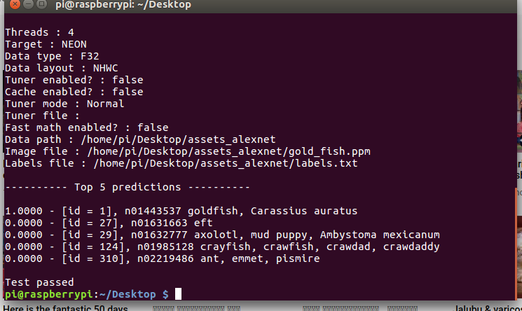
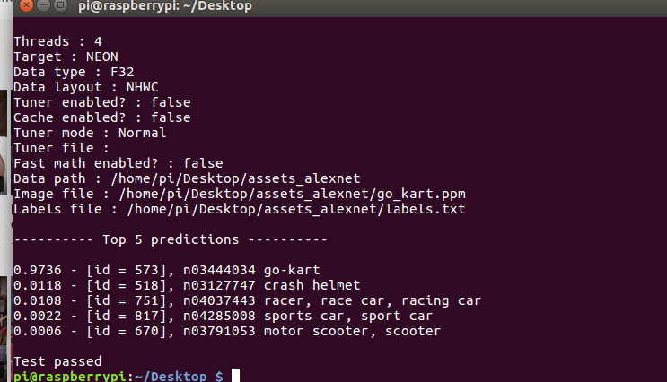
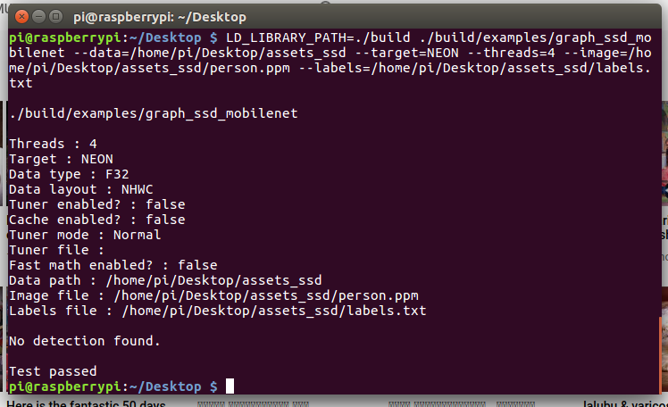

## HOW TO RUN ARMCL on Raspberry Pi 3B+ 64 bit model

* Download Raspbian 64 bit OS from [here](https://downloads.raspberrypi.org/raspios_arm64/images/raspios_arm64-2020-05-28/2020-05-27-raspios-buster-arm64.zip)

* Follow this document to flash OS using [etcher](https://vitux.com/how-to-flash-burn-an-os-image-with-etcher-on-ubuntu/)

* Now there are two ways to compile ARM Compute Library(armcl) , one is on native machine and other by cross compiling on Linux based machines:

* I personally recommend to follow the second step, where armcl is compiled on a Linux based machine and used on raspberry pi.

* Steps to ross compile:

* Note: Make sure you alread have gcc and g++ compilers are already installed

### Step 1: To install tool chain type this command.

```bash
sudo apt-get install -y gcc-arm-linux-gnueabihf g++-arm-linux-gnueabihf gcc-arm-linux-gnueabi g++-arm-linux-gnueabi binutils-arm-linux-gnueabi g++-aarch64-linux-gnu gcc-aarch64-linux-gnu make
```

### Step 2: Install scons for python3.
```python
pip3 install scons
```

### Step 3: After installing required libraries, clone armcl from [here](https://github.com/ARM-software/ComputeLibrary.git):

* cd $ARML (armcl main directory).

* Run this command on armcl's main directory:

```bash
scons arch=arm64-v8a benchmark=1 benchmark_tests=1 opencl=0 neon=1 cppthreads=1 benchmark_tests=1 os=linux -j3 Werror=0
```
### Step 4: Download AlexNet weights:

* Get alexnet weights from [here](https://developer.arm.com/-/media/43359E999DEF433BAF63523C529D21AD.ashx?revision=c1a232fa-f328-451f-9bd6-250b83511e01&_ga=2.180724647.1628733436.1604462256-196896801.1604462256). It would be a zip file, extarct it's contents and keep them in seperate folder called **assets_alexnet** .

### Step 5: SSH into raspiberry pi.

* Follow this commands and make sure you have enabled ssh on your raspberry pi and you know it's ip address.
```bash
scp $ARMCL/build/examples/graph_alexnet $ARMCL/build/libarm_compute_core.so $ARMCL/build/libarm_compute.so $ARMCL/build/libarm_compute_graph.so pi@pi's_ip_address::Desktop/build/
scp -r path/to/assets_alexnet pi@pi's_ip_address::Desktop
```
### Step 6: Now open command line on you raspberry pi and run this lines.

```
cd Desktop
LD_LIBRARY_PATH=./build ./build/graph_alexnet \
--data=/home/pi/Desktop/assets_alexnet \
--target=NEON \
--threads=2 \
--image=/home/pi/Desktop//go_kart.ppm \
--labels=/home/pi/Desktop/labels.txt

```

### Results:

<p align="center">
  
</p>


<p align="center">
  
</p>

## Issues:

* Followed the same procedure for mobilenet also, but here it does'nt finds any detection, will dug down more for insights.


<p align="center">
  
</p>

