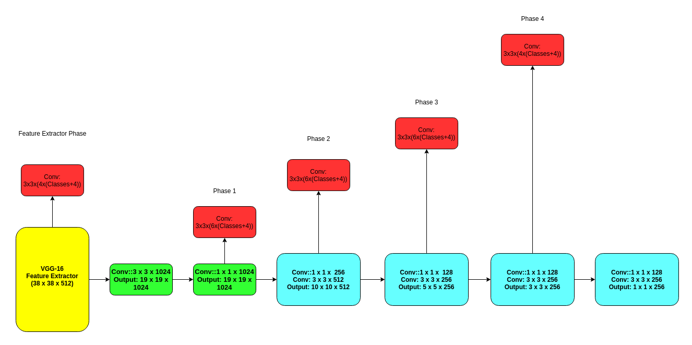
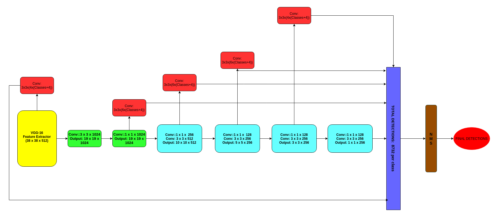
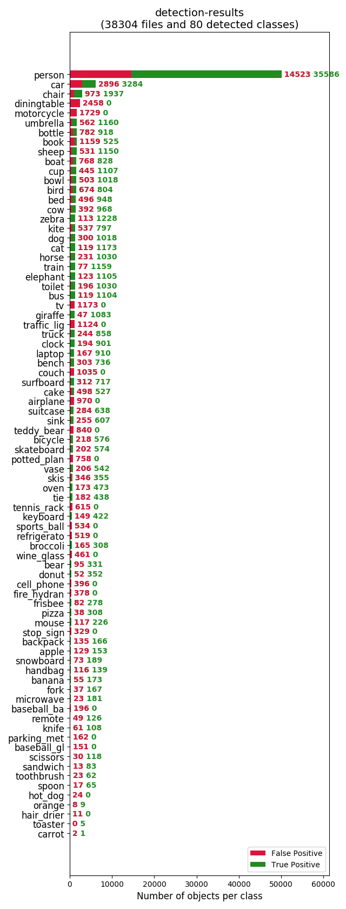
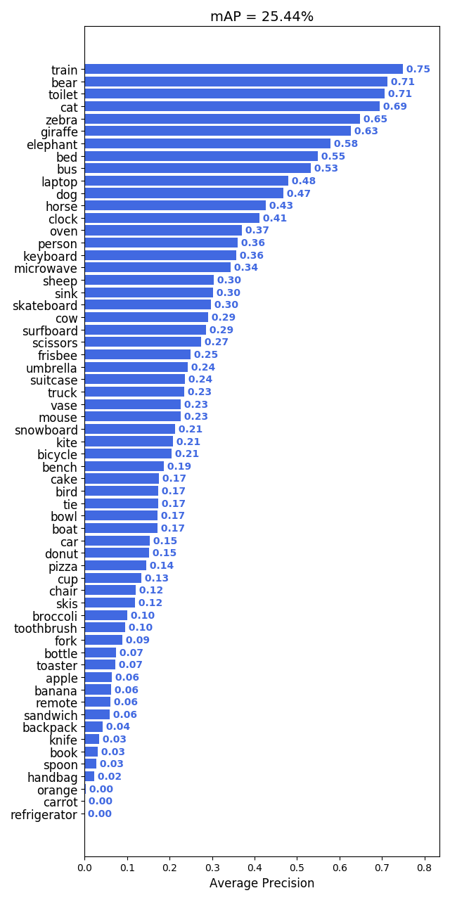
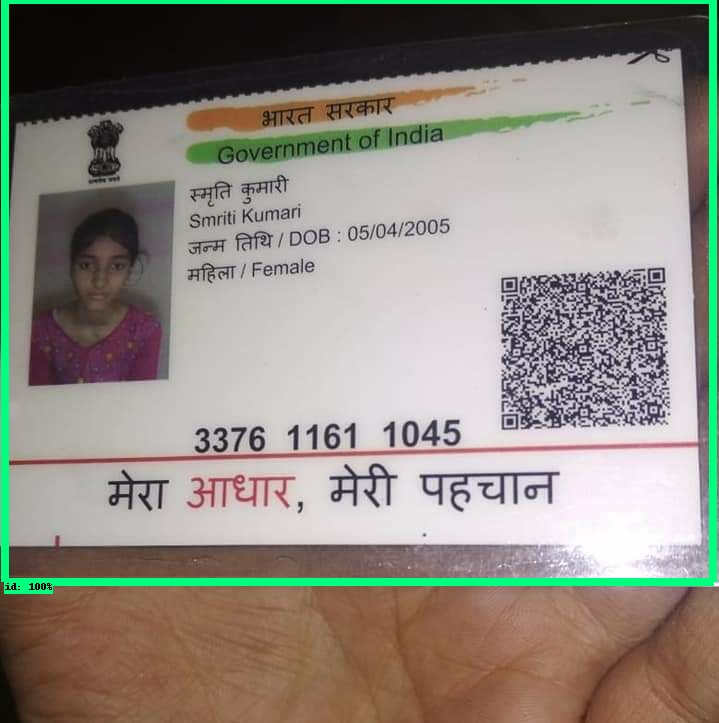
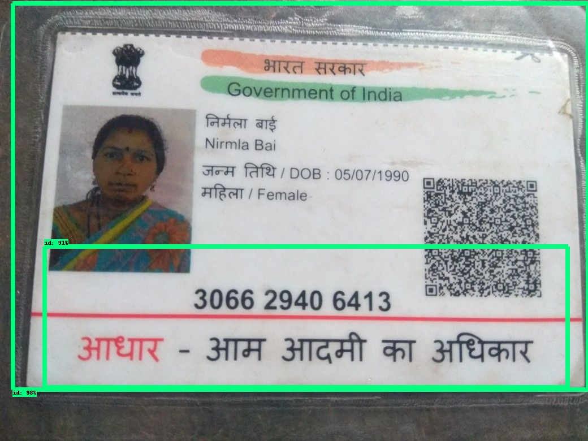

# Single Shot multibox Detectors (SSD):

**Note: SSD module is generalized on VGG-net.**  

* Unlike Faster RCNN which deals with detection process in two phases after feature extractor layer i.e. **RPN(Regional Proposal Network)** + **Detection Layer**, SSD framework does that in a single go.

* Here the output from feature extractor is further reduced to smaller dimensions in four phases. The output at these 4 phases including the output from the feature extractor output are passed on to a 3 x 3 x **variable size channels respective to a phase** .   

**Note 1: Please open it in new tab**  

  

* So if you see te image above, consider phase 1 and in that phase the output goes through 3 x 3 X (4 x (classes+4)) convolution, in this convolution the first **4** in **(4 x (classes+4))** denotes the number of default boxes for which the convolution generates offsets.

* Second **4** in the same expression denotes the co-ordinates for the detected object. For example consider there are 3 objects to be classified then the output would look like **4 x (3 + 4) = 4 x 7**, 3 in the given expression denotes binary label for the object confidence in the given box.

* At the output fro the intermediate phases(approx. 8732 detections/class) are given to the NMS module which in turn removes redundant boxes and gives refined output of all detections in an image.

  

* Same pipeline is followed for **ssd** and **ssdlite** for object detection purpose.

* The only difference between ssd and ssdlite, **ssdlite** uses depthwise seperabale convolutions in phase convolutions module. 

### Source:[Link](https://arxiv.org/pdf/1512.02325.pdf)

## MobileNetV2SSDLite , COCO 2104 validation dataset results:

#### MobileNet-V2 SSD Lite detections Result:

##### 1. Class Wise mAP:

* The same dataset of COCO Val 2014 which was used for SSD is used to test SSD Lite. There were total 38304 images where detections were made by ssd-lite
 

  

**Note: Please open the above image in new tab for more clarity**

* The mean average precision of MobileNet-SSD lite is **25.44%** on 61 classes. Here it misses out 20 classes namely:
1. dining table
2. motor-cycle
3. tv
4. traffic-lights 
5. couch 
6. airplane
7. teddy bear
8. potted_plant
9. tennis racket
10. sports-ball
11. refrigerator
12. wine-glass
13. cell-phone
14. fire-hydrant
15. stop-sign
16. baseball-bat
17. parking meter
18. baseball glove
19. hot dog
20. hair-drier   

##### 2. Total Number of True Positives and False Positives per class:

  

**Note: Please open the above image in new tab for more clarity**  

## Midv Card Dataset

* The original training dataset image samples:

  

* Test Results on **MobileNetV2SSDLite**:

  

  

  

  

  

